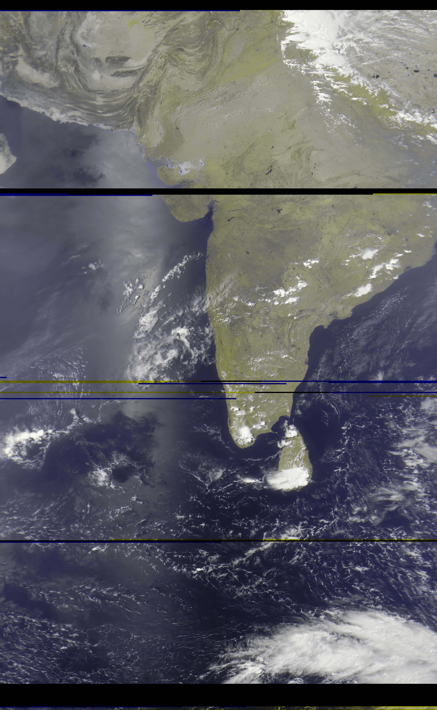
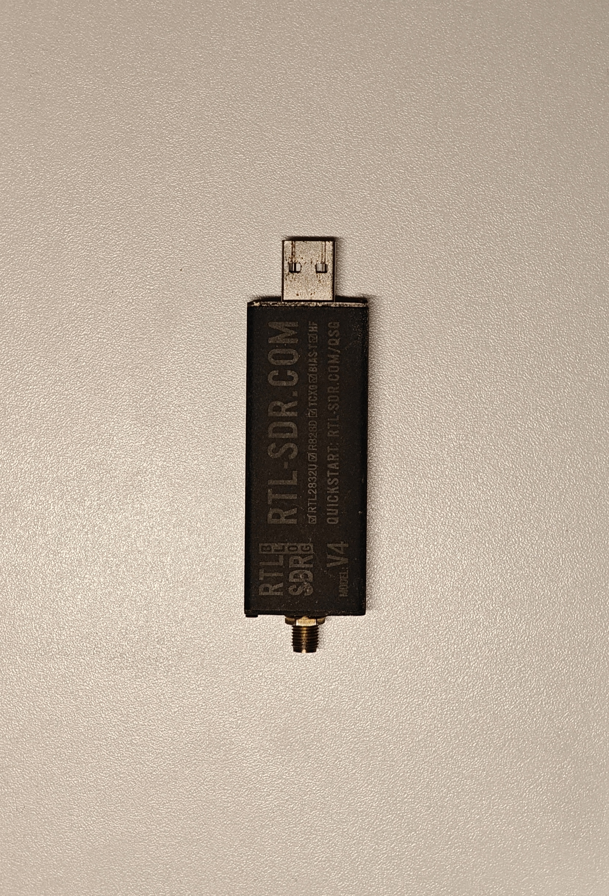
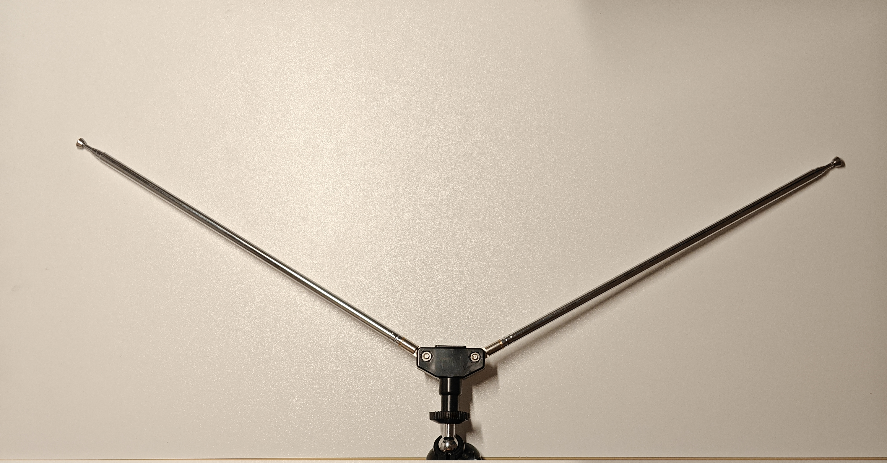
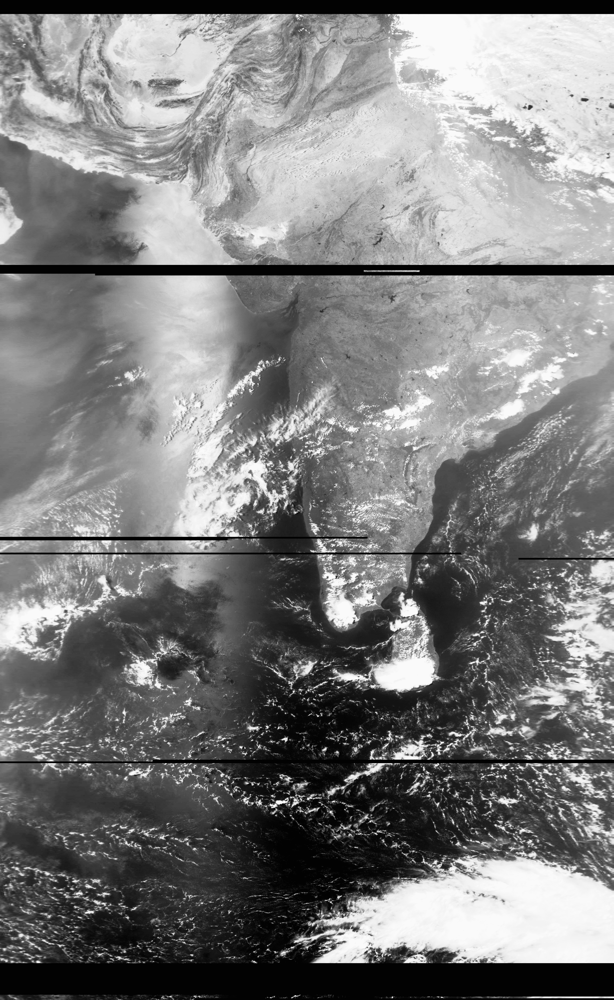

# Meteor-M2 Weather Satellite Reception

Receiving and decoding LRPT weather imagery from the Meteor-M2-4 satellite using a RTL-SDR v4 and a V-dipole antenna.

## Background
### Meteor M2-4
The Meteor-M2-4 is a polar-orbiting (North - South) weather satellite operated by Roscosmos, launched in 2024. It flies in a sun-synchronous low Earth orbit at an altitude of roughly 820 km, completing a full orbit about 14 times a day. Therefore, it passes over any location on Earth a couple of times per day, each pass lasting around 10-15 minutes. It is possible to receive data from it during this time window.

It's main sensor, the MSU-MR multispectral scanner, images the Earth's surface and cloud cover for weather forecasting, ice and sea-state monitoring, and climate observation. Alongside its primary science function, the satellite continuously broadcasts a lower-resolution scan of this imagery in real time via LRPT. LRPT(Low Rate Picture Transmission) is a digital signal transmitted around 137 MHz. Unlike most satellite downlinks, LRPT is openly broadcast with no encryption or licensing needed to decode it, specifically to enable anyone throughout the world to receive and decode it's data for scientific and meteorological purposes.

### SDR
In a traditional radio receiver, filtering, demodulation, and decoding are handled by dedicated analogue hardware built only for one specific job. On the other hand, a software-defined radio (SDR) moves most of that processing into software, with the hardware only digitising a chunk of the RF spectrum. All of the processing after that (tuning, filtering, demodulating, decoding) happens on the connected computer. This is what makes a SDR extremely versatile, as the same piece of hardware can be used for a number of different tasks, just by using different software and tuning to different parts of the RF spectrum as required.

The RTL-SDR V4 used here is used for it's economical price and high compatibility with software on Windows as well as Linux.

## How it works

As the satellite crosses overhead during a pass, the SDR captures the transmits the RF signal, corrects for the continuously shifting Doppler offset caused by the satellite's relative motion, demodulates the signal, and reconstructs the image line by line as data arrives.

- **Signal chain:** Antenna → SDR → SatDump → final image

SatDump is the main software used in the signal chain. It can also generate false-colour composites from the original black-and-white captures from the satellite. 

### Pass Prediction & Tracking

Passes are short and only occur a few times a day per satellite, so timing is of importance. Pass-prediction tools are used to plan ahead, the one I prefer is **Look4Sat** (Android)
During active passes, the built-in tracking of SatDump can be used.

## Details of the Build

### Antenna: Self-Built V-Dipole

A V-dipole was built and tuned for the 137 MHz weather satellite band using the kit, rather than buying a commercial antenna. The optimal dimensions being, **53.5cm** for each leg and a **120°** angle between the legs. A dipole was chosen over a directional design because it needs no rotator to track a satellite moving across the sky during a pass, although a directional design offers better gain. 

The open antenna is aligned either towards the North or South, depending on the direction that the satellite is approaching from. It is mounted perpendicular, 1m above the ground.

### No LNA

The signal chain was kept deliberately simple, without an external LNA ahead of the SDR. The V4's improved front-end and direct-sampling mode give it noticeably better sensitivity than older RTL-SDR dongles, which made this workable. The trade-off being that only high elevation passes with a clear line of sight produce ideal results.  

### Doppler Correction

Due to Meteor-M2 being in low Earth orbit, its relative velocity shifts the received frequency continuously throughout the pass. SatDump applies Doppler correction in real time during capture, using the predicted orbital trajectory to track and compensate for this shift. (The TLEs must be kept updated within SatDump for this feature to work correctly)

### Troubleshooting

It took about 20 tries over multiple months to get all the variables dialed in, time of day and week, dimensions of the antenna design, SatDump settings, weather conditions, etc.

Original black-and-white image, captured on 21.04.2025

## Equipment List

- RTL-SDR V4 dongle ( including kit)
- V-dipole antenna (tuned for 137 MHz band)
- Coax cable + connectors (from kit)
- Laptop running SatDump
- Look4Sat for mobile pass tracking

## Antenna Diagram
